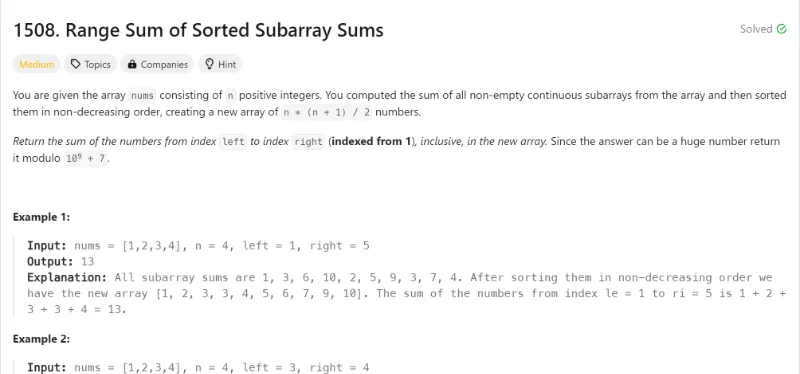
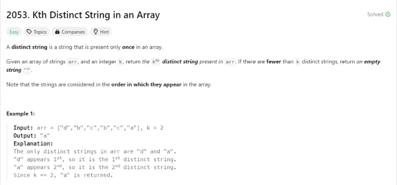
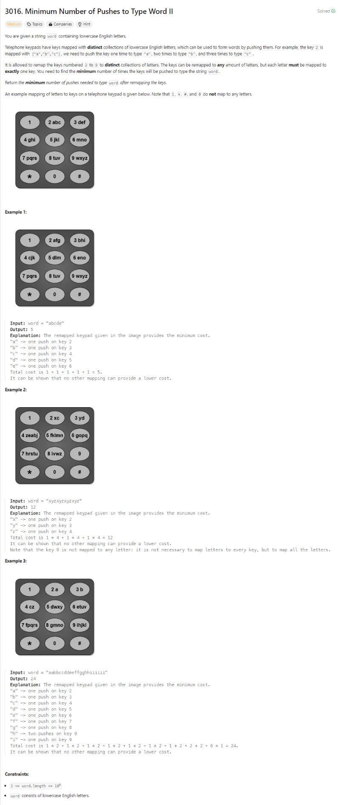
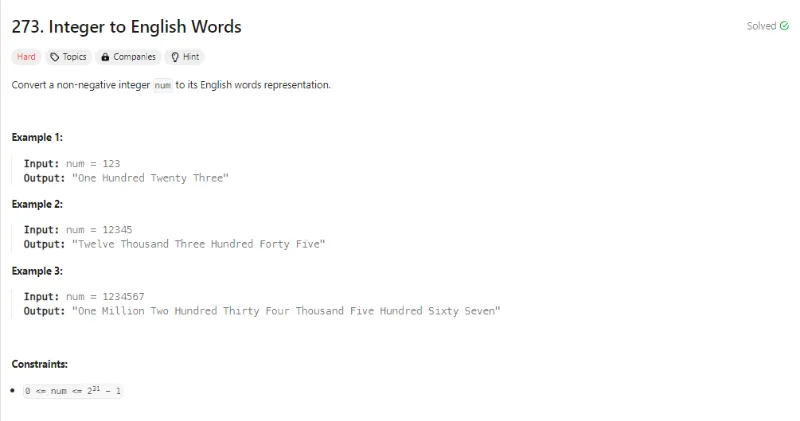
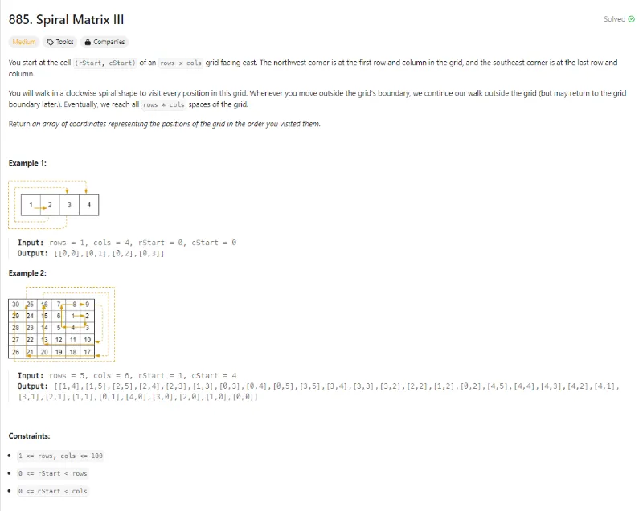
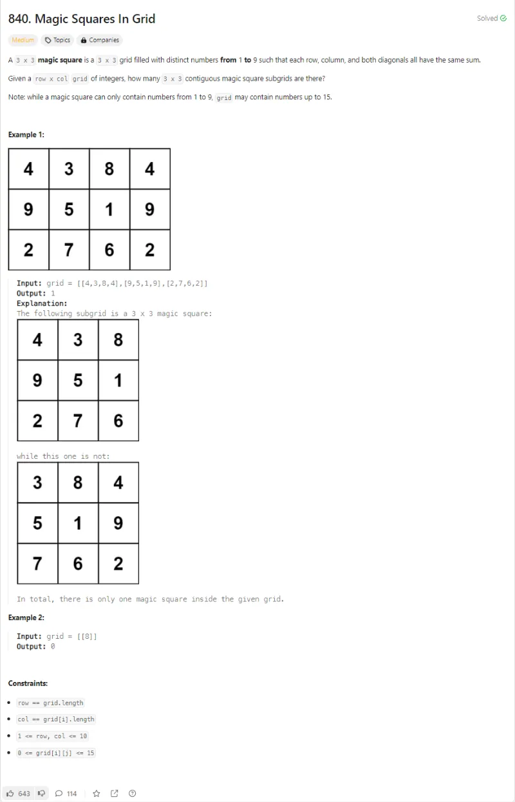
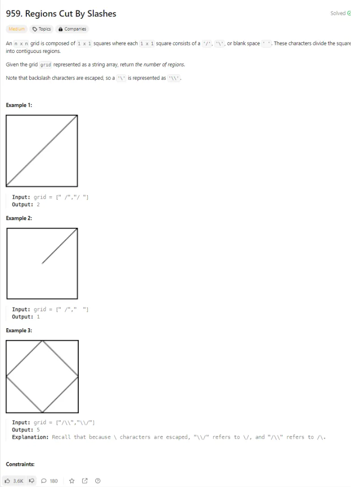
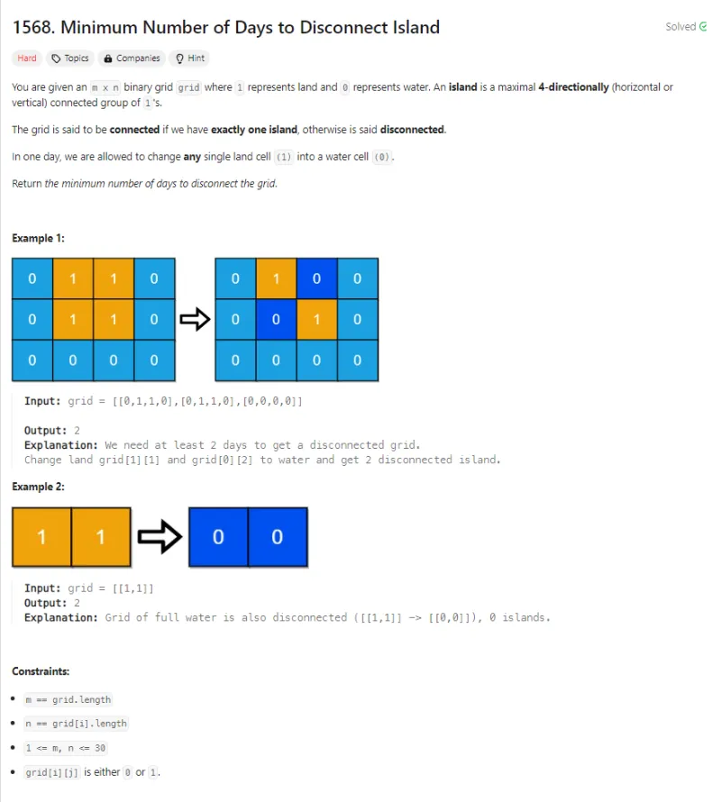
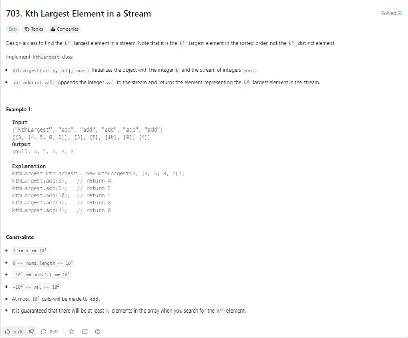
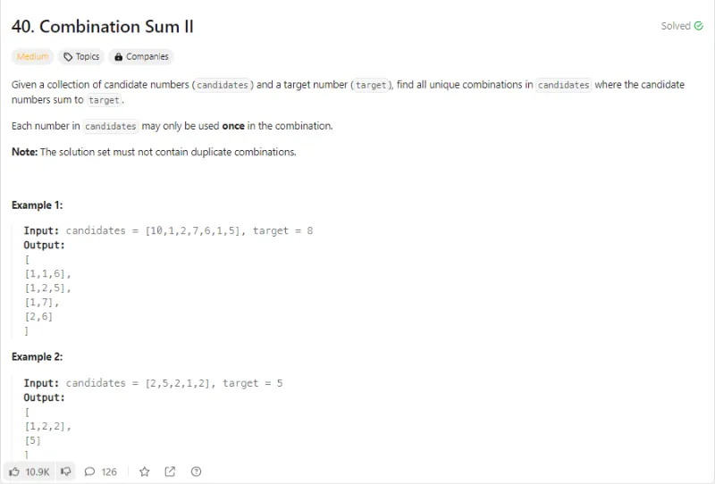

# Problem Description 1-10

## Problem 1: 1508- Range Sum Sorted Array

## Problem 2: 2053- kth distinct string in an array

## Problem 3: 3016- Minimum number of pushes to type word ii

## Problem 4: 273- Integer to English Words

## Problem 5: 885- Spiral Matrix III

## Problem 6: 840- Magic Squares In Grid

## Problem 7: 959- Regions Cut By Slashes

## Problem 8: 1568- Minimum Number of Days to Disconnect Island

## Problem 9: 706- kth Largest Element in a Stream

## Problem 10: 40- Combination Sum II

