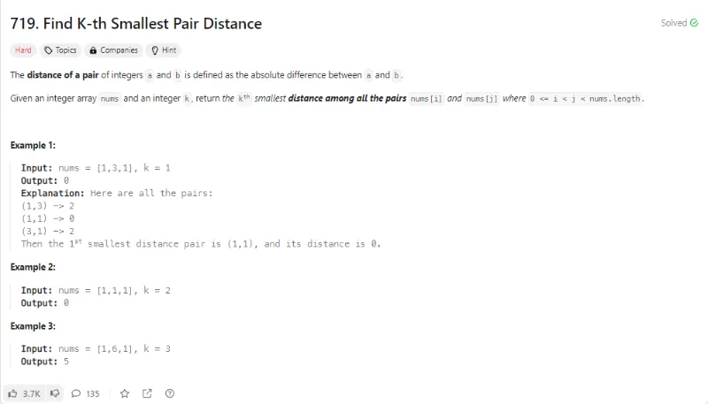
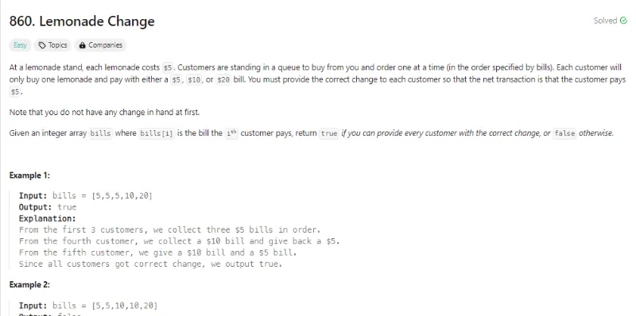
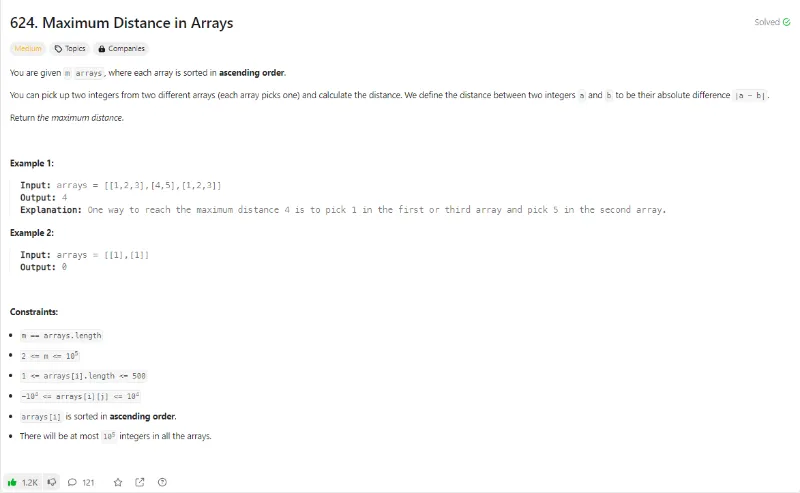
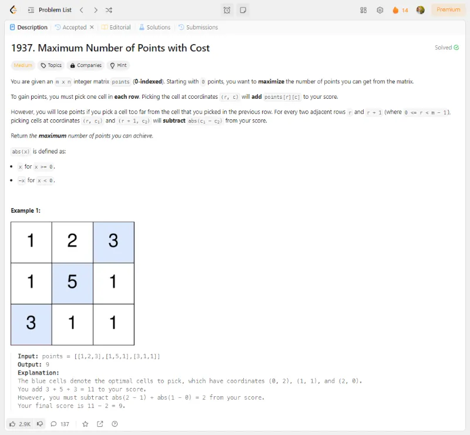
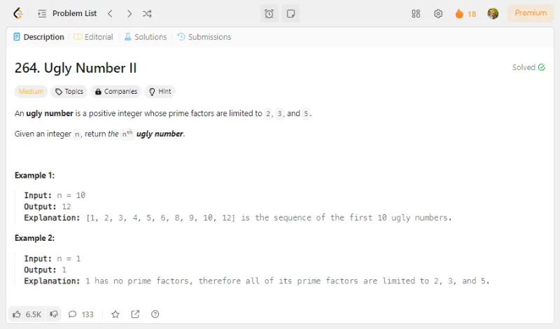
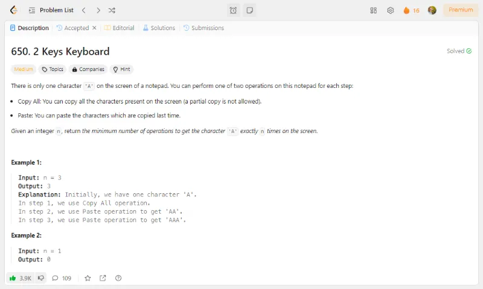
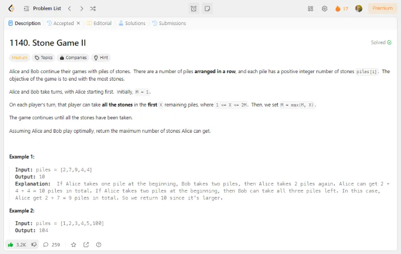
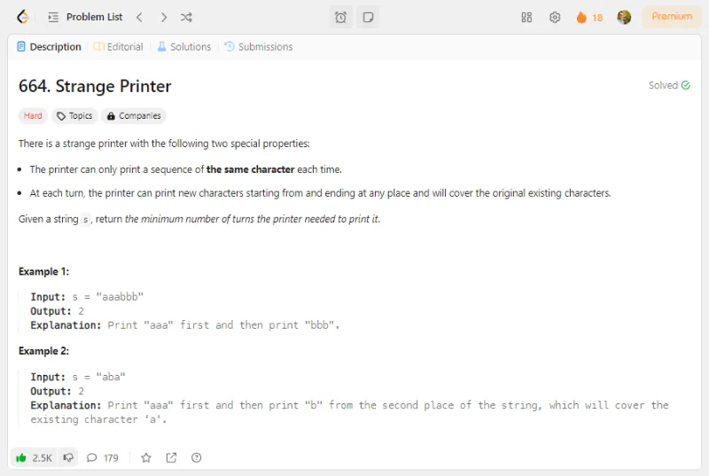
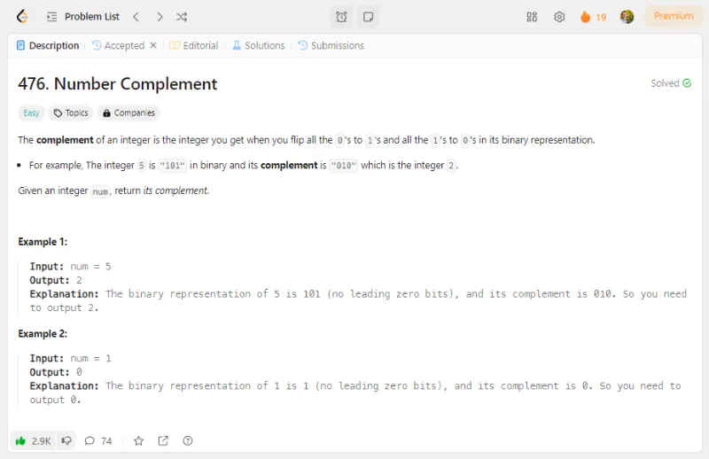
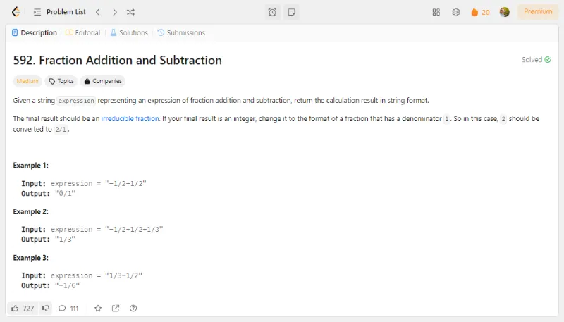

# Problem Description 11-20

## Problem 11: 719- Find Kth Smallest Pair Distance

## Problem 12: 860- Lemonade Change

## Problem 13: 624- Maximum Distance in Arrays

## Problem 14: 1937- Maximum Number of Points with Cost

## Problem 15: 264- Ugly Numbers II

## Problem 16:650- 2 Keys Keyboard

## Problem 17: 1140- Stone Game II

## Problem 18: 664- Strange Printer

## Problem 19: 476- Number Complement

## Problem 20: 592- Fraction Addition and Subtraction

