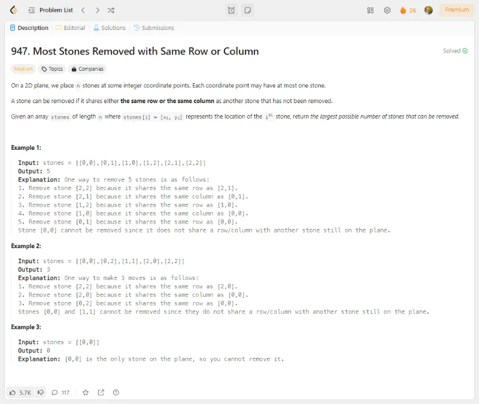

# Problem Description 21-30

## Problem 21: 564- Find the Closest Palindrome

## Problem 22: 145- Binary Tree Postorder Traversal

## Problem 23: 590- N-ary Tree Postorder Traversal

## Problem 24: 1514- Path with Maximum Probability

## Problem 25: 1905- Count Sub Islands

## Problem 26: 947- Most Stones Removed with Same Row or Column

## Problem 27: 2699- Modify Graph Edge Weights

## Problem 28: 1514- Path with Maximum Probability

Repeated problem. Same problem as 24

## Problem 29: 2022- Convert 1D Array Into 2D Array

## Problem 30: 1894- Find the Student that Will Replace the Chalk

