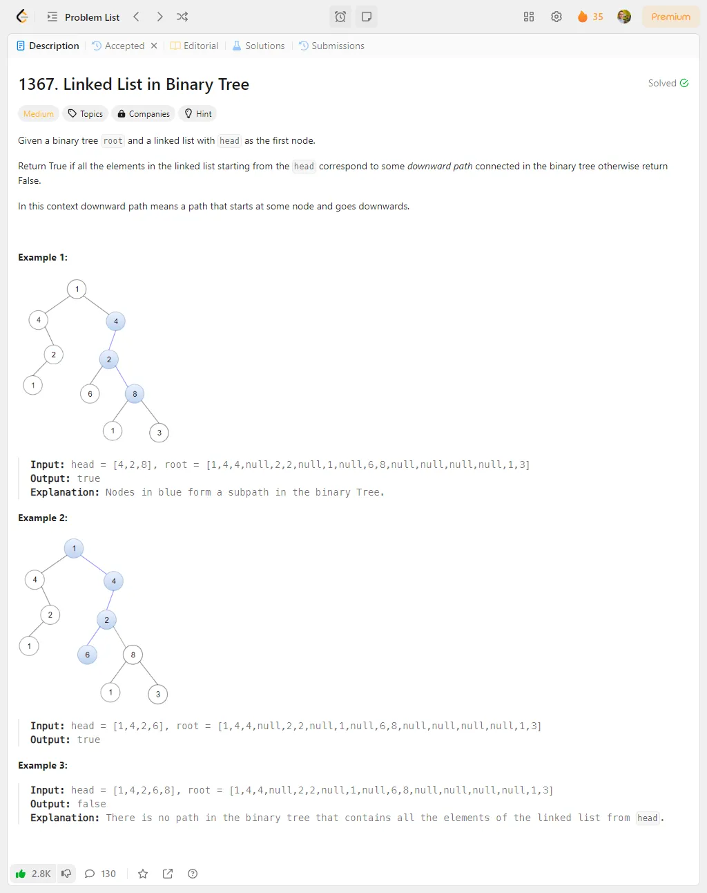

# Problem Description 31-40

## Problem 31: 1945. Sum of Digits of String After Convert

## Problem 32: 847. Walking Robot Simulation

## Problem 33: 2028. Find Missing Observations

## Problem 34: 3217. Delete Nodes From Linked List Present in Array

## Problem 35: 1367. Linked List in Binary Tree

## Problem 36: 725. Split Linked List in Parts

## Problem 37: 2326. Spiral Matrix IV

## Problem 38: 2807. Insert Greatest Common Divisors in Linked List

## Problem 39: 2220. Minimum Bit Flips to Convert Number

## Problem 40: 1684. Count the Number of Consistent Strings2

