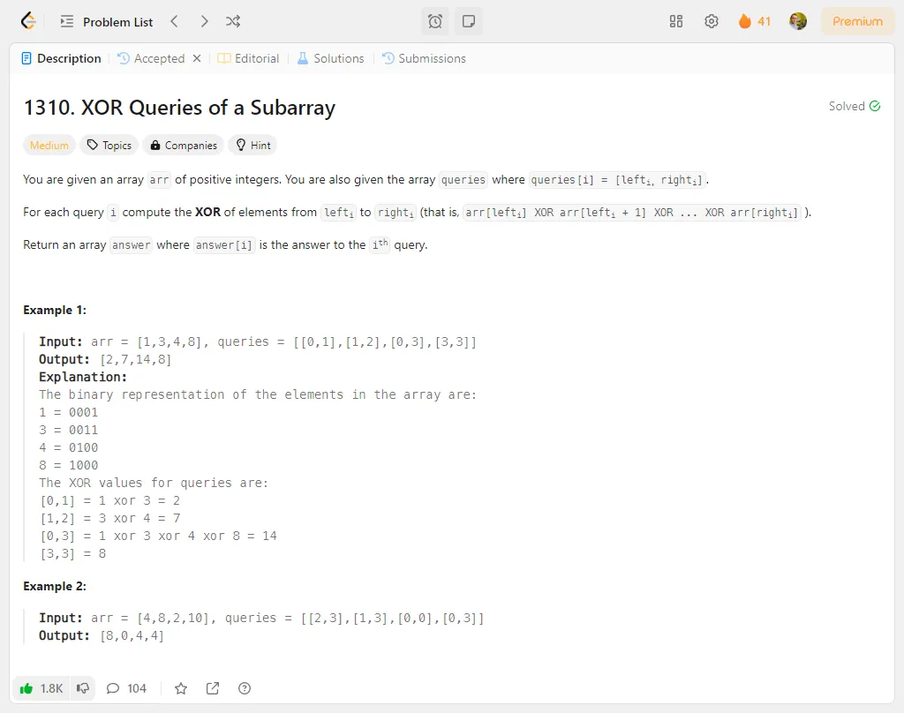

# Problem Description 41-50

## Problem 41: 1310. XOR Queries of a Subarray

## Problem 42: 2419. Longest Subarray With Maximum Bitwise AND

## Problem 43: 1371. Find the Longest Substring Containing Vowels in Even Counts

## Problem 44: 539. Minimum Time Difference

## Problem 45: 884. Uncommon Words from Two Sentences

## Problem 46: 179.Largest Number

## Problem 47: 241.Different Ways to Add Parentheses

## Problem 48: 214. Shortest Palindrome

## Problem 49: 386.Lexicographical Numbers

## Problem 50:440.K-th Smallest in Lexicographical Order

