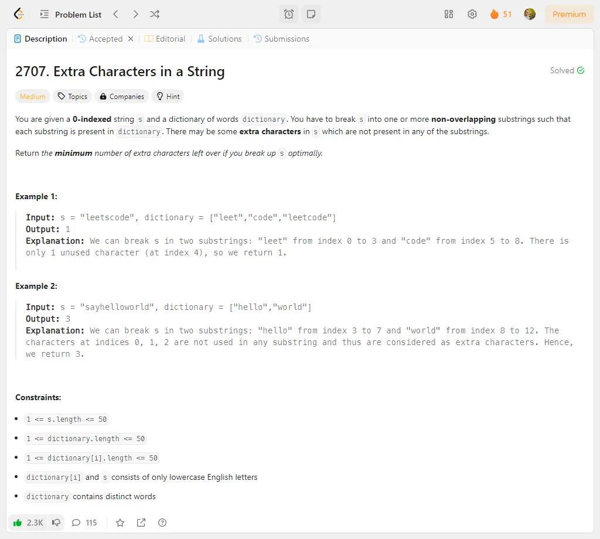
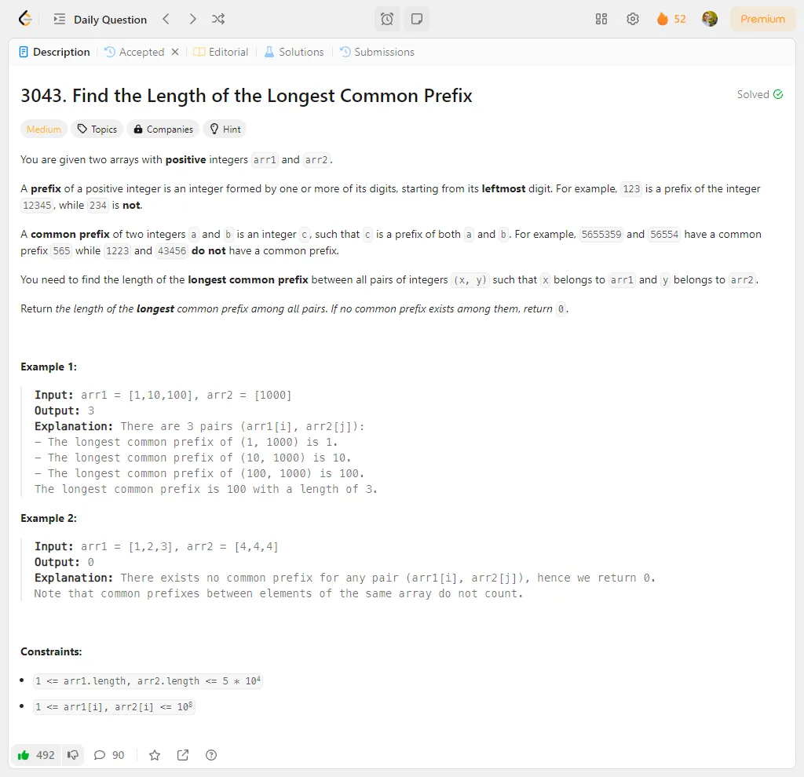
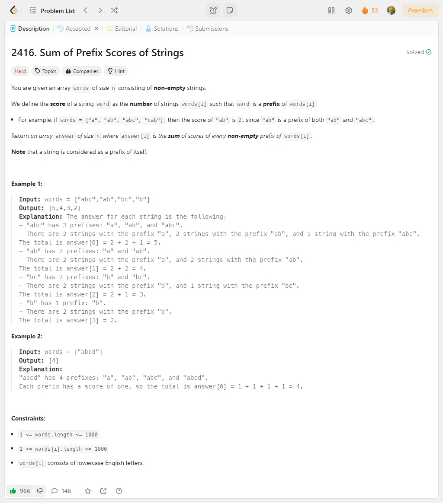
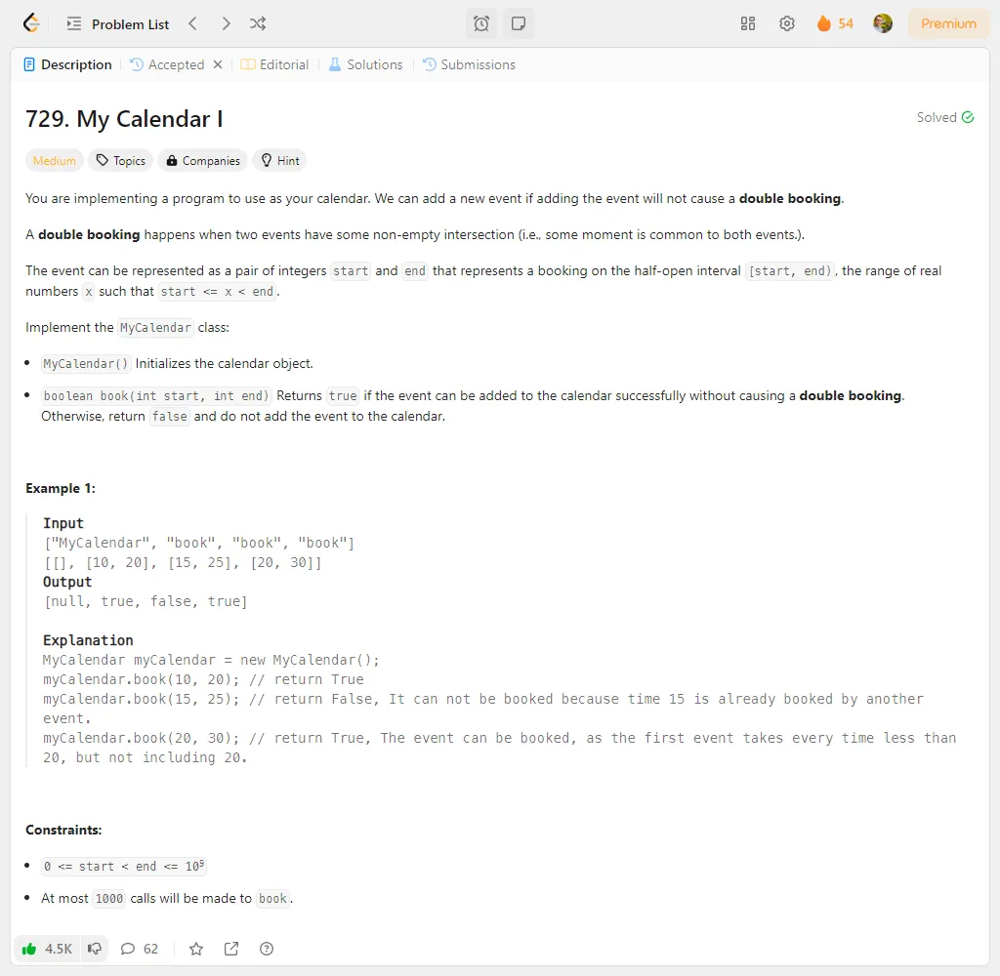
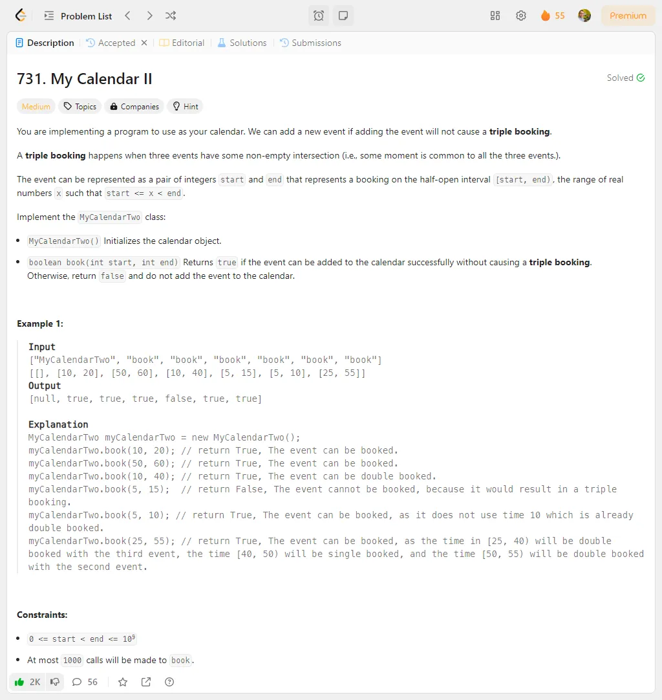
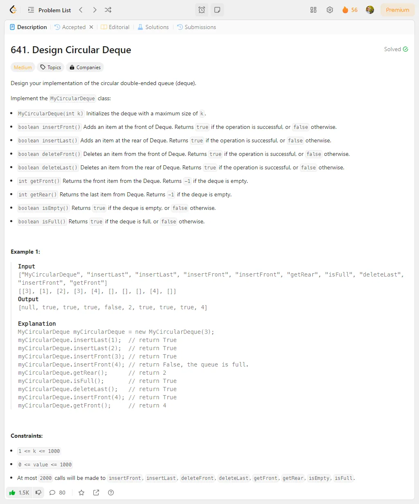
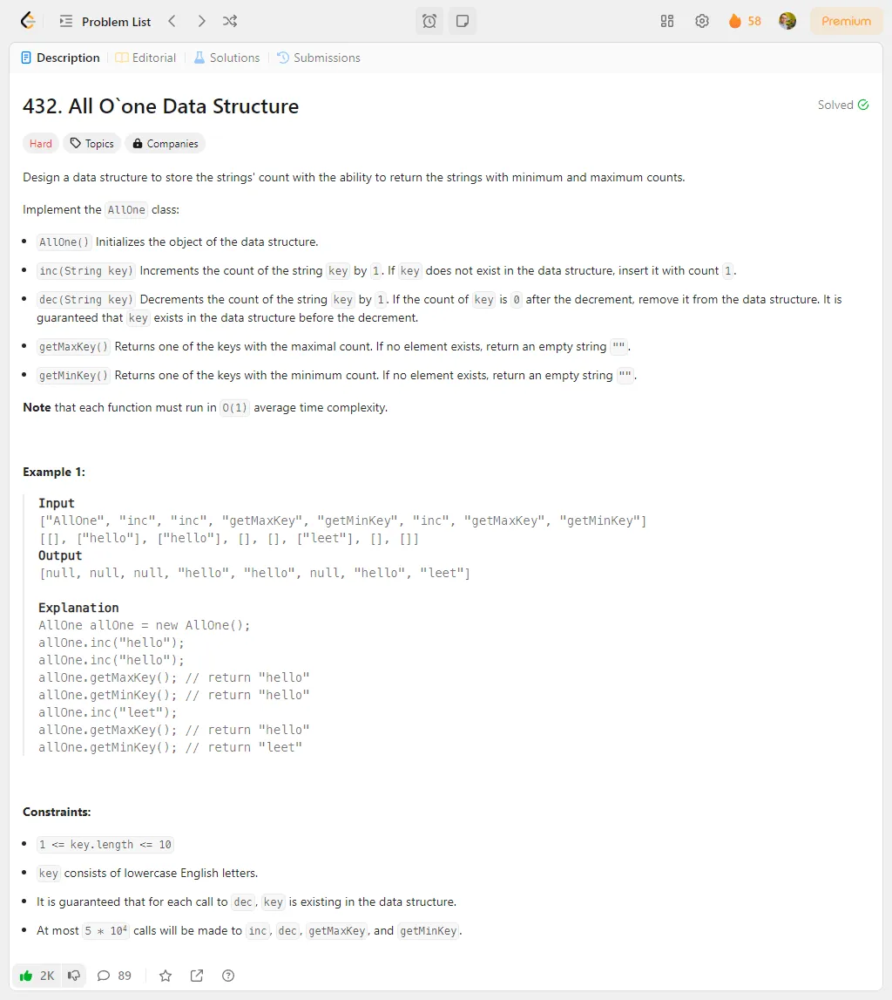
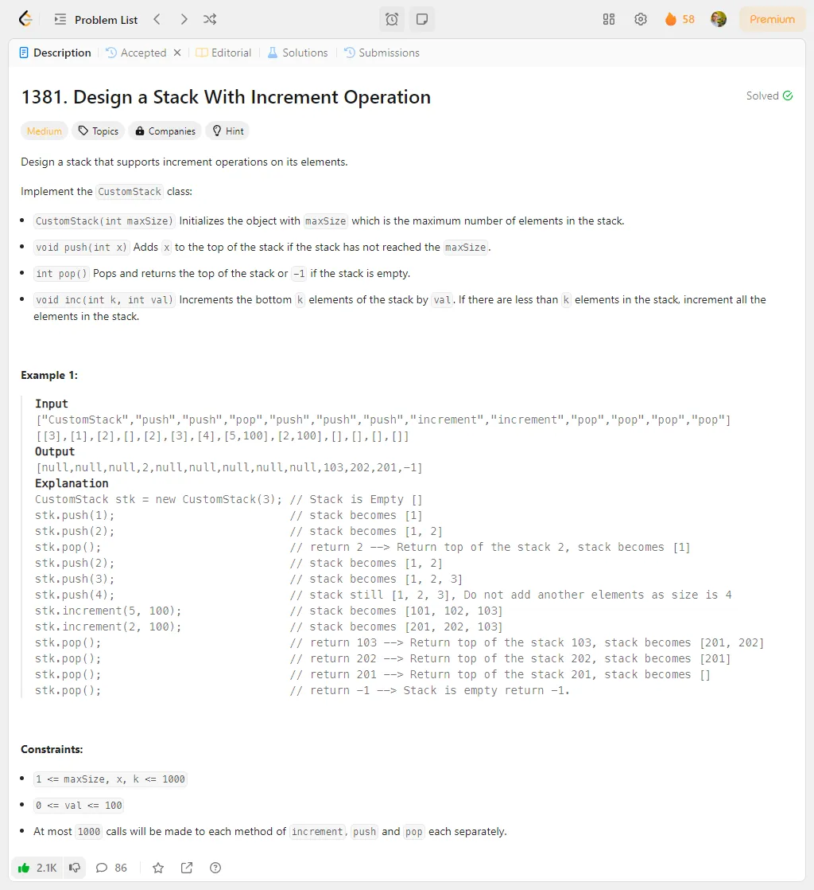
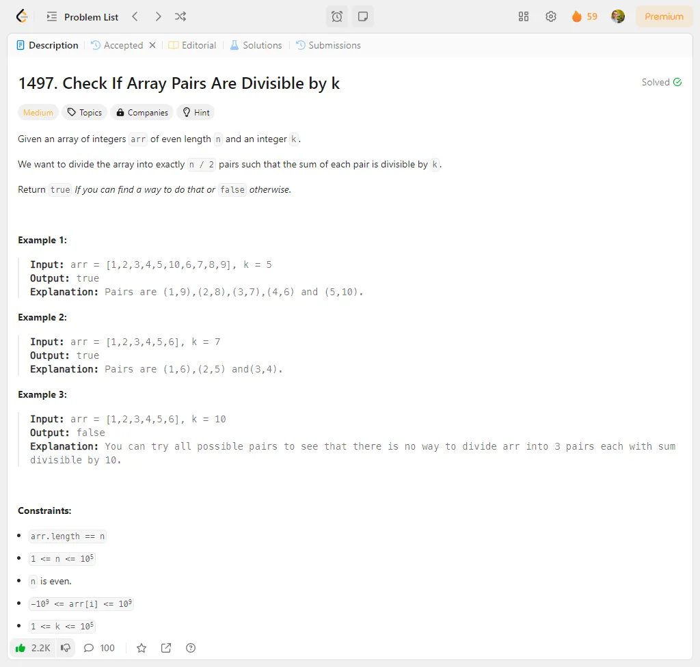
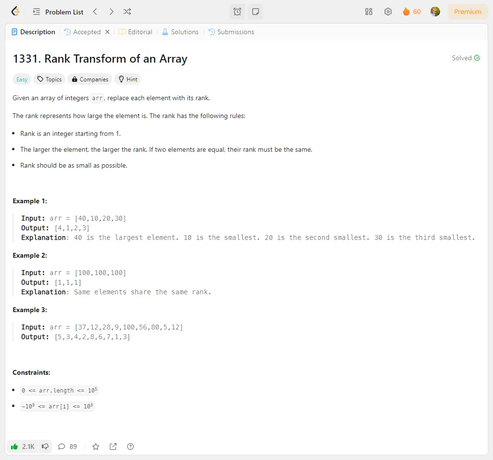

# Problem Description 51-60

## Problem 51: 2707. Extra Characters in a String

## Problem 52: 3043. Find the Length of the Longest Common Prefix

## Problem 53: 2416. Sum of Prefix Scores of Strings

## Problem 54: 729. My Calendar I

## Problem 55: 731. My Calendar II

## Problem 56: 641. Design Circular Deque

## Problem 57: 432. All O(1) Data Structure

## Problem 58: 1381. Design a Stack With Increment Operation

## Problem 59: 1497. Check If Array Pairs Are Divisible by k

## Problem 60: 1331. Rank Transform of an Array

