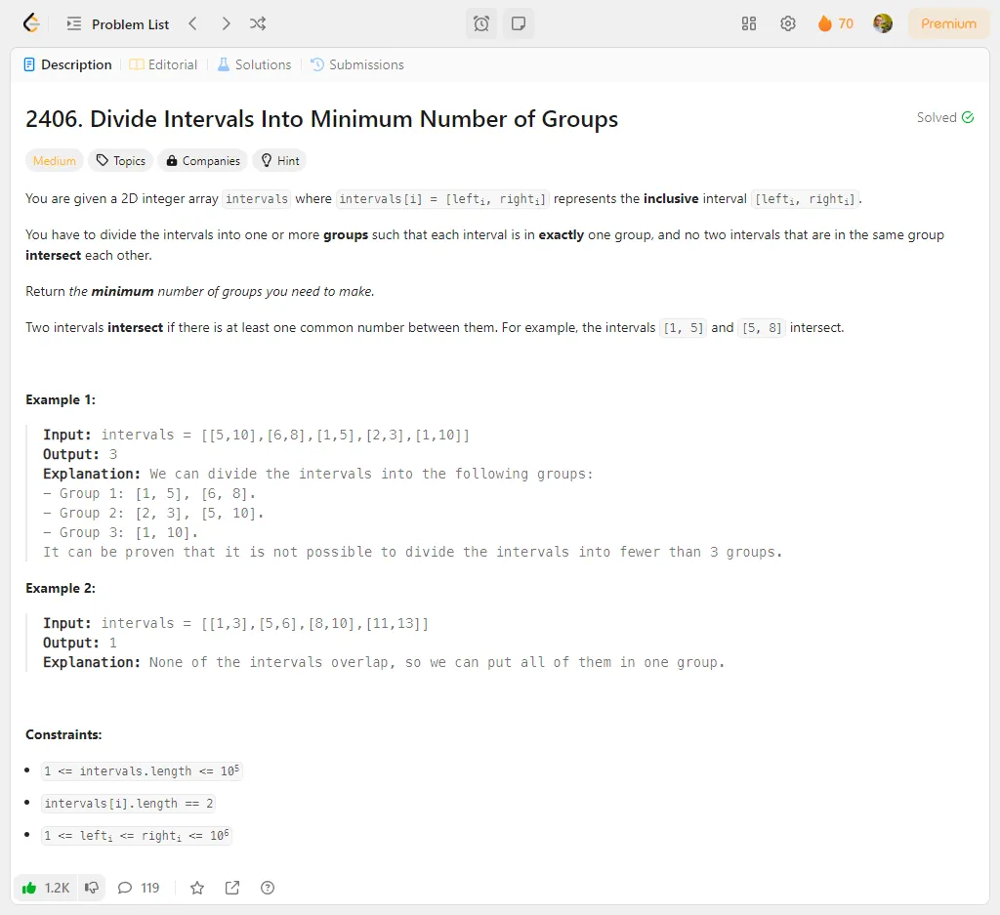

# Problem Description 61-70

## Problem 61: 1590. Make Sum Divisible by P

## Problem 62: 2491. Divide Players Into Teams of Equal Skill

## Problem 63: 567. Permutation in String

## Problem 64: 1813. Sentence Similarity III

## Problem 65: 2696. Minimum String Length After Removing Substrings

## Problem 66: 1963. Minimum Number of Swaps to Make the String Balanced

## Problem 67: 921. Minimum Add to Make Parentheses Valid

## Problem 68: 921. Minimum Add to Make Parentheses Valid

## Problem 69: 1942. The Number of the Smallest Unoccupied Chair

## Problem 70: 2406. Divide Intervals Into Minimum Number of Groups

