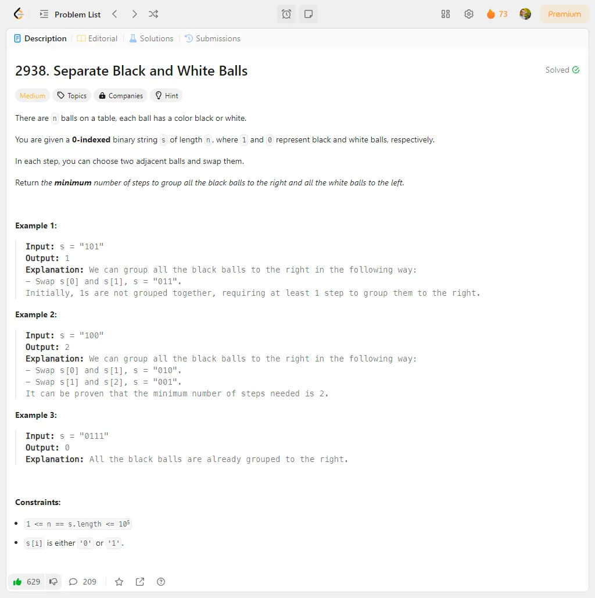

# Problem Description 71-80

## Problem 71: 632. Smallest Range Covering Elements from K Lists

## Problem 72: 2530. Maximal Score After Applying K Operations

## Problem 73: 2938. Separate Black and White Balls

## Problem 74: 1405. Longest Happy String

## Problem 75: 670. Maximum Swap

## Problem 76: 2044. Count Number of Maximum Bitwise-OR Subsets

## Problem 77: 1545. Find Kth Bit in Nth Binary String

## Problem 78: 1106. Parsing A Boolean Expression

## Problem 79: 1593. Split a String Into the Max Number of Unique Substrings

## Problem 80: 2583. Kth Largest Sum in a Binary Tree

