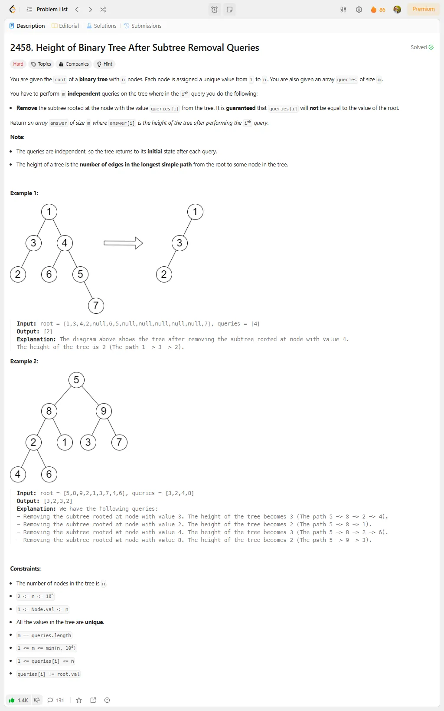
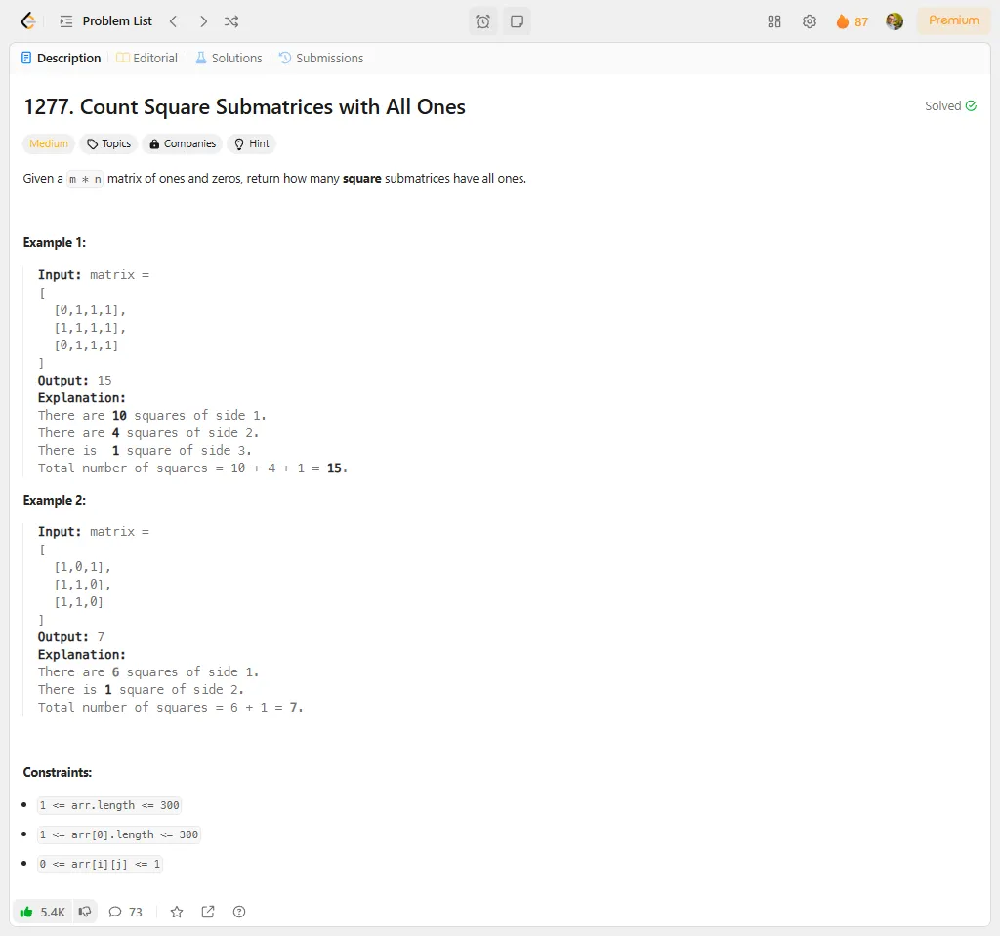

# Problem Description 81-90

## Problem 81: 2641. Cousins in Binary Tree II

## Problem 82: 951. Flip Equivalent Binary Trees

## Problem 83: 1233. Remove Sub-Folders from the Filesystem

## Problem 84: 2458. Height of Binary Tree After Subtree Removal Queries

## Problem 85: 1277. Count Square Submatrices with All Ones

## Problem 86: 2501. Longest Square Streak in an Array

## Problem 87: 2684. Maximum Number of Moves in a Grid

## Problem 88: 1671. Minimum Number of Removals to Make Mountain Array

## Problem 89: 2463. Minimum Total Distance Traveled

## Problem 90: 1957. Delete Characters to Make Fancy String

